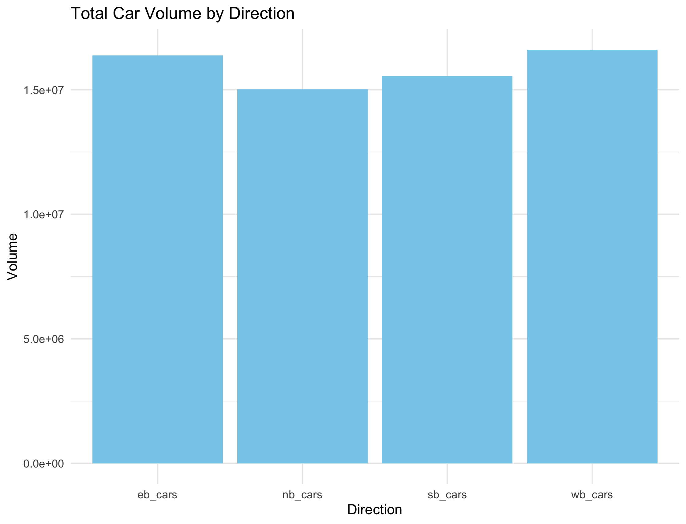
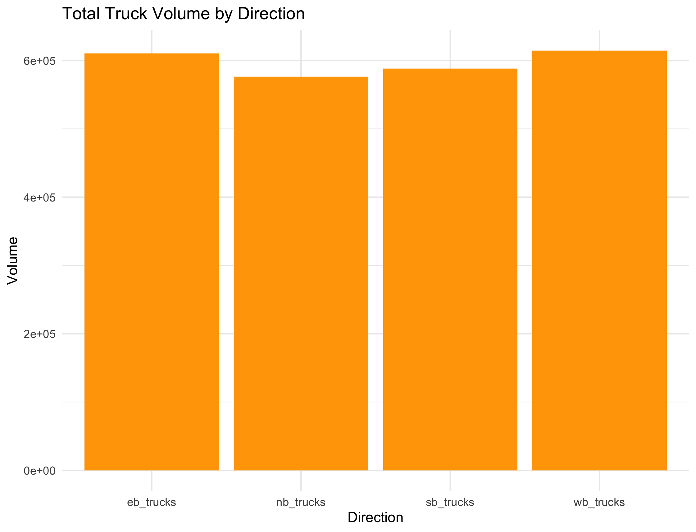
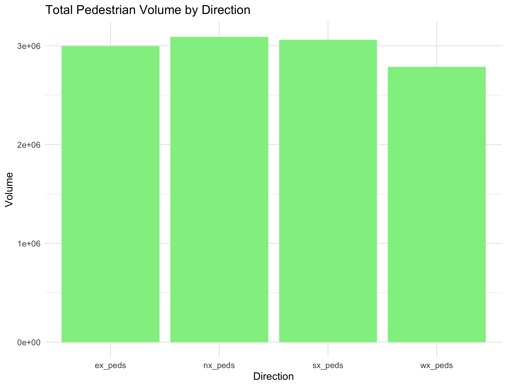

## Project Summary

### Car Volume Analysis
- **Highest volume**: Westbound - 16,599,439
- **Second highest**: Eastbound - 16,383,146
- **Lower volume**: Northbound - 15,021,955
- **Lowest volume**: Southbound - 15,560,978
- **Conclusion**: Car traffic is more in east-west probably on major commuting routes.

### Truck Volume Analysis
- **Highest volume**: Westbound - 614,398
- **Second highest**: Eastbound - 610,286
- **Lower volume**: Southbound - 588,223
- **Lowest volume**: Northbound - 576,230
- **Conclusion**: Truck traffic is also more in east-west probably on commercial routes.

### Pedestrian Volume Analysis
- **Highest volume**: Northbound - 3,089,897
- **Second highest**: Southbound - 3,061,695
- **Lower volume**: Eastbound - 2,997,509
- **Lowest volume**: Westbound - 2,787,277
- **Conclusion**: Pedestrian traffic is more in north-south probably because of access to transit or maybe shopping areas.

### Overall Conclusions
- **Cars and Trucks**: Mostly move east-west that shows main travel and transport routes.
- **Pedestrians**: Mostly move north-south that shows main walking paths and transit access.
- **Insight**: Directions show different patterns for cars and people that matches how Toronto is set up with its transit paths.

## Visualizations

- **Total Car Volume by Direction**: 
- **Total Truck Volume by Direction**: 
- **Total Pedestrian Volume by Direction**: 
